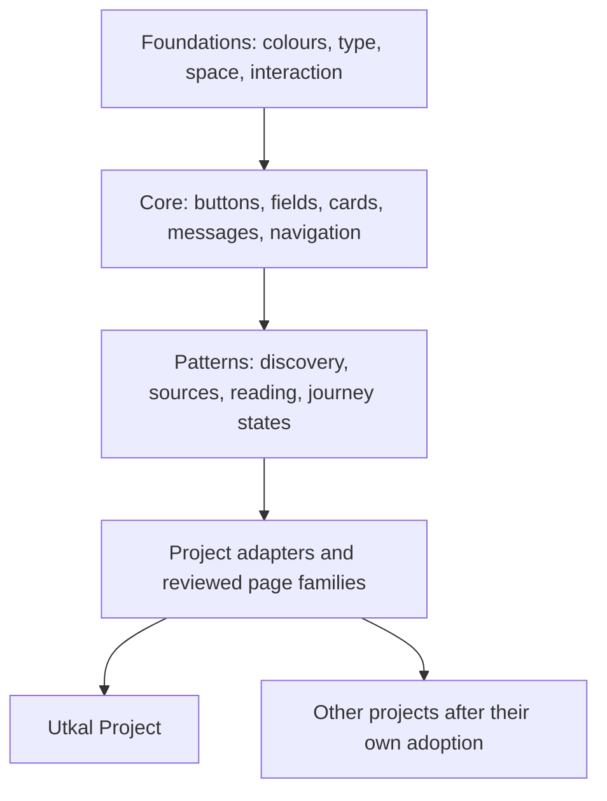

# Utkal Design System 0.1.0-rc.4

**Purpose:** let people recognize a shared Utkal family across knowledge, discovery and future associated projects, while keeping each project's content, governance and purpose clear. Creative direction: Ahimanikya Satapathy. Implementation and original utility icons: current AI assistant. Kabita Live supplied a user-authorized design reference; its identity, magazine artwork, service configuration and team assignments were not imported.

## Layers

Tokens and shared styles are framework-independent. The package uses prefixed `--uds-` custom properties and `utk-` component classes. Generic element styling is scoped under `.utk`; there is no global reset. The candidate UTP page adapter is deliberately outside the distributable core because legacy selector changes are application-specific.

## Media and meaning

> A picture makes the text more readable, and a video makes the music more listenable
>
> — Ahimanikya Satapathy

Design media and content together. Choose a photograph, diagram, montage, AI visualization or video for the meaning it communicates: orient, explain, evoke or accompany. AI imagery can explain a subject better than a single available photograph; distinguish that explanatory value from documentary evidence. The [media and meaning foundation](media-and-meaning.md) gives entity examples, page rhythm, music/video guidance and a short media brief. Apply it to the open inner-page refinement, not just hero decoration.

## Foundations

`projects/design-system/tokens.json` is the executable source of truth. The generated `styles/tokens.css` must not be edited independently. The existing public site's earlier definitions remain until it explicitly migrates; they do not become another source for the new package.

| Purpose | Foundation |
|---|---|
| Headings, links, actions | Nila Sagara `#1D4658` |
| Highlights and editorial emphasis | Mankada Pathara `#91462F` |
| Supporting material tones | Sukha Ghasi olive `#74633B`, straw `#C1A263` |
| Surfaces | Canvas `#FBF6EC`, warm panel `#F2E6D0` |
| Text and muted text | `#302E28`, `#706658` |
| Status | Text labels plus success/error support; never colour alone |
| Space | 4, 8, 12, 16, 24, 32, 48, 64 and 96px equivalents expressed in rem |
| Main controls | 3rem minimum target, 4px corner radius, visible 3px focus ring |
| Reading and canvas | 68ch reading measure inside a fluid canvas up to 120rem |

Brand values and material stories remain unchanged. Sukha Ghasi is the dried cow-dung-and-paddy-straw cooking-fuel cake from the Founder's memory. Separate English and Odia wordmarks remain intact. Specimen headlines are demonstrations, not replacements for the established tagline.

## Typography candidate

- **Display:** Cormorant Garamond 500, with a genuine italic for selected English emphasis.
- **Long reading:** Source Serif 4; body prose approximately 1.2rem/1.85, with app-specific refinement after review.
- **Interface:** familiar system sans serif, with an Odia fallback.
- **Odia:** variable Noto Serif Oriya, upright and naturally spaced. Regular weight is available for sustained reading, rather than forcing all text through a bold face.

Only unmodified, locally held SIL OFL distributions are included, with their original author licences. No Google Fonts/CDN dependency. Other scripts need explicit font and language review when introduced. A rendered font does not establish linguistic correctness.

## Component contracts

| Family | Classes / responsibility |
|---|---|
| Layout | `utk-wrap`, `utk-stack`, `utk-row`, `utk-grid`, `utk-section` keep consistent measures and spacing. |
| Identity and navigation | `utk-header`, `utk-brand`, `utk-nav`, `utk-breadcrumb`, `utk-footer`; labelled navigation, current-page state and wrapped phone layouts. |
| Openings and media | `utk-hero`, `utk-media`; use different page patterns rather than one fixed magazine split. Preserve focal points and descriptive captions. |
| Type | `utk-reading`, `utk-eyebrow`, `utk-muted`, `utk-highlight`, with explicit `lang` on script changes. |
| Actions | `utk-button`, secondary and quiet variants. Use real buttons for actions and links for navigation. Label icon-only controls and manage busy/disabled/pressed states in the consuming app. |
| Cards | `utk-card`, `utk-card__body`, `utk-tags`, `utk-tag`, `utk-missing-image`. Match food, place, person and stay-area metadata to the actual entity. |
| Fields | `utk-field`, labelled inputs, help and errors. The app owns validation, focus and submission; CSS alone does not make a form functional. |
| Status and recovery | `utk-message`, error and success variants. Say what happened and how to continue. |
| Sources | `utk-disclosure` for end credits and source notes. Attribution requirements, writer names and documentary/illustrative distinctions remain substantive. |
| Utility icons | Twelve original single-colour symbols: search, save, check, download, print, arrow, external, place, book, menu, close and contribute. Symbols support visible labels and do not establish cultural or historical claims. |

Core CSS includes reduced-motion and forced-colour handling. Baseline print styles are included; app-specific A4 pagination remains a separate verification task. Disabled controls are excluded from normal-text contrast claims.

## Review gallery and pilots

The local gallery has ten groups: identity, type, media and meaning, rhythm, actions, discovery, forms, feedback, sources and pilots. It includes current/proposed typography, functional sample save state, combined search/category filtering, empty-state recovery, validation focus, review notes and JSON export. It never submits a contribution or applies a project decision.

Four complete copies of actual UTP pages demonstrate the candidate: **Chilika**, **Chhena Poda**, **Gopinath Mohanty** and **My Odisha Journey**. The first three demonstrate subject-specific storytelling; journey planning remains a functional reference. At the separate local review origin, saved journeys are separate from the live/4324 site. Links inside a pilot lead to the copied baseline pages unless they explicitly open another pilot.

A tablet overflow in Chilika's minimum-height photo stage was found and corrected in the candidate adapter. The public-site baseline was not altered by this work. This fix belongs in the later UTP migration.

## State of completion

This version is a reusable implementation and visual candidate. The Founder authorized building the system; that is not blanket acceptance of every typography, radius or layout choice. Review preferences are browser-local notes and exports, not automatic source edits or formal publication approval. [Verification and limits](../records/design-system-review.json) remain part of the handoff.

## Lessons carried into the shared system

Use low-specificity defaults for basic elements so real applications can preserve their photo geometry and readable text on coloured panels. Add the explicit inverse button variant on a dark surface. Keep card children and form controls shrinkable, and let labels wrap. Do not use a fixed aspect ratio with a conflicting minimum height: the Chilika tablet stage needed a local correction.

A migration inventory must include standalone pages, generated viewers and dynamically created controls, not only the main page layout. Review previews should use actual application output once adopted. Keep fonts and licence files together in both the reusable package and the website export.

See the [first adoption record](utp-adoption.md) for observed findings and verification limits.

## Lessons from the next twenty pages

- Reuse the place and voice templates, but supply honest context for every visual. A village landscape is not a workshop photograph; a typographic name panel is not a portrait or script specimen.
- A recovery action should name what it restores and return focus to the recovered item. Undo restores the removed idea only, preserving edits made elsewhere.
- Sorting, region and topic filters should share one URL state. Preserve meaningful Odia marks when normalising text.
- Use a compact day overview as navigation, without implying a feasible route or travel-time estimate.
- Keep data operations in the consuming app; the library supplies readable fields, states and actions. No new shared token was needed for this batch.

## Lessons from connected discovery

Use one photographic card pattern for a directory and its homepage preview; maintain the same photo context and accessible credits in both. Show a starter’s actual contents before its save action. A successful action must reflect a successful storage write: prepare a candidate separately, retain the prior collection on failure and offer a recoverable download. Reading connections must not imply a travel route. These are application composition and behaviour lessons; shared tokens remain at 0.1.0-rc.2.

## Lessons from visitor planning

Group photo-led and text-only cards into separate, coherent rows rather than leaving short cards stranded beside tall ones. Preserve reading order in the markup, not CSS-only reordering. Protect full portraits when a card becomes wide. Wide pages can hold photographs generously while prose keeps a readable measure; stack side columns before tablet text becomes cramped. Optional planning states need a visible meaning and honest persistence feedback. These application refinements retain the 0.1.0-rc.2 shared foundations; a broader inner-page visual review remains open.

## Lessons from the story reference pilots

Version 0.1.0-rc.3 adds reusable invitations, reading routes and visual pauses while preserving the palette and typography. Place, food and person stories have distinct outcomes. Preserve complete historical portraits, interleave images with relevant passages, and let wide-screen imagery coexist with bounded prose. The [story pattern guide](story-patterns.md) records the contracts, media boundaries and remaining rollout.

## Composition before components

The Founder found the first reference pages jumpy and disorganised. Reusable patterns are optional tools, not a sequence to assemble by default. Use one opening, one reading navigation and a clear subject-to-story-to-action progression. Keep a stable reading axis, avoid repeated imagery and introductions, and make supplementary media optional. Assess a continuous reading experience in addition to individual component and responsive checks. The three local references have been simplified accordingly; the shared package remains rc.3.

## Magazine family in rc.4

The selected visual magazine direction now provides shared cover, chapter navigation, reading rows and warm chapter styles. Four local references compare a lagoon, a heritage destination, a food and a writer. Mobile navigation uses a native disclosure and the cover places its photograph before the actions. [Review checkpoint and remaining rollout](magazine-family-review.md). Earlier rc.3 statements above record the previous stage.
