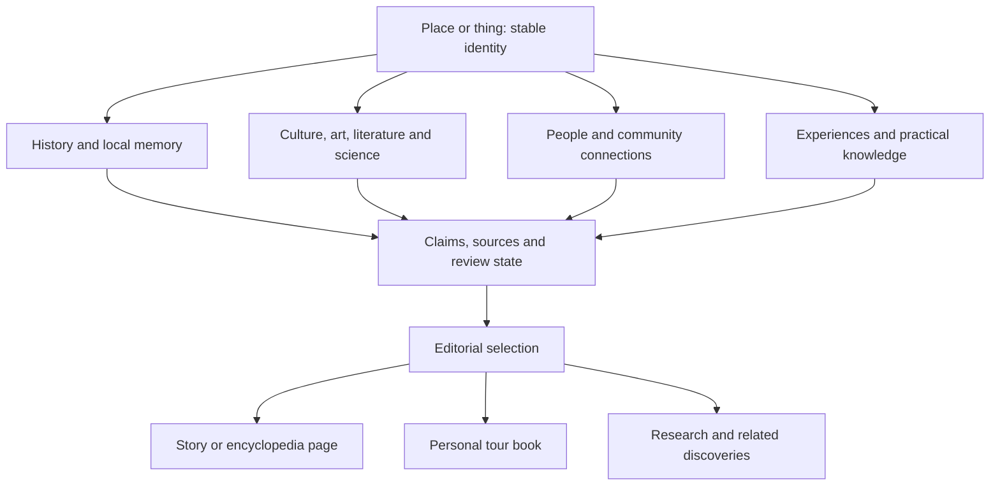

# Utkal Knowledge & Story Model

**Candidate v0.1 · 29 September 2026 UTC**

Concept and direction: **Ahimanikya Satapathy**, Founder & Editor-in-Chief. Structure and documentation prepared with AI assistance from his instructions. This is the proposed UTP editorial information model. It does not rename the initiative, establish a new project prefix or apply a new organization-wide Blueprint rule.

We should be able to know a place deeply, narrate it warmly and help someone experience it well. The same underlying knowledge should support an encyclopedia, a story, a research view and a personal tour book. This model extends the [destination model](destination-model.md) beyond a visitor checklist.

## Three layers, one body of knowledge

1. **Entity record:** the place, food, object, craft, festival, person, language or cultural work. Stable identity and structured knowledge live in the project KB.
2. **Evidence and connections:** individual claims, sources, local accounts and typed relationships. These explain what we know, how we know it and how entities belong together.
3. **Narrative view:** an editor selects and orders supported material for a particular audience. A story is a view of knowledge, not a competing factual database.

A place connects to its sites, food, people, poems, films, ecology and communities. A food or object connects back to its makers, materials, process, geography and use. The knowledge network can grow without creating a separate essay that repeats every fact for every connection.

## Place information hierarchy

The record follows this hierarchy; the page can adapt the presentation. Each module has a research state, entries and gaps. Empty space is a research question, not permission to generate a plausible fact.

| Layer | What we collect | Questions that produce useful stories |
| --- | --- | --- |
| **1. Identity and orientation** | Preferred English and Odia names, local/older names with language and period, place type, region, parent/contained places, coordinates and gateways, short significance | What is this place? Where is it? Which part does the visitor actually mean? What makes it distinctive? |
| **2. Historical significance** | Dated events, historical periods, archaeology, trade and migration, changes in use, contested interpretations, original sources | What happened here? Why did it matter? What survives, and what changed? |
| **3. Local stories and living memory** | Myths, legends, oral histories, place-name stories, remembered events, narrator/collector and version | What do people tell about it? Who tells that version? What does the story mean locally? |
| **4. Famous spots and experiences** | Landmarks, neighbourhoods, viewpoints, lesser-known sites, ranked editorial highlights, activities and realistic visit considerations | What deserves time? What detail would most visitors miss? What suits a first visit or a return? |
| **5. Food and everyday life** | Must-try dishes, ingredients, preparations, household/regional variation, seasonality, dietary knowledge, verified markets or venues | What can someone taste here? Is it native to this place, associated with it, or simply available? |
| **6. Literature, music, art and screen** | Poems, songs, books, painting, sculpture, architecture, crafts, dance, films and their exact connection to the place | How has this place been imagined, sung, made or shown? What can someone read, hear or notice while there? |
| **7. Nature, science and knowledge** | Ecology, species and habitats, geology, seasonal processes, scientific work, technology, institutions and documented local knowledge | What makes the landscape work? What has been observed, discovered or invented here? |
| **8. People and their words** | Notable people, why their contribution matters, precise place relationship, verified quotations and context | Who shaped this place or was shaped by it? What did they actually say, and when? |
| **9. Meet and support local people** | Community-led walks, guides, maker visits, workshops, performances, language courtesies, public events, hosts and participation arrangements | How can a visitor join respectfully, learn from someone and pay them fairly? Who actually welcomes a visit? |
| **10. Plan a good visit** | Best time by interest, seasonal trade-offs, access, transport, duration, stays, costs, facilities, accessibility and suitability | When should I go for my interests? What should I arrange first? Can my party use the facilities? |
| **11. Honest expectations and conduct** | Strengths, drawbacks, friction, documented hazards, local rules/customs, dos and don’ts, environmental considerations, alternatives | What will delight me? What may disappoint or require preparation? What should I do or avoid, and why? |
| **12. Related discoveries and evidence** | Connected places/things, further reading/listening, assets, source mapping, rights, checking dates and research gaps | What should I explore next? How can I verify or improve this account? |

Historical significance can lead the narrative after a short introduction, as the Founder proposes. It is not compulsory to invent a grand past for every place. A wetland may lead with ecology, a food with its making, a neighbourhood with people, while preserving the same deeper information hierarchy.

## Common entity envelope

| Field | Meaning |
| --- | --- |
| `id`, `entity_type`, `subtype` | Stable identifier and classification. IDs survive renaming; `place:chilika` continues to mean the existing place. |
| `names[]` | Text, language/script, preferred/local/historical/transliterated kind; source and period where relevant. Do not silently equate a historical region with modern borders. |
| `summary` | Brief editorial introduction, with supporting claim IDs. Original narrative has its own authorship. |
| `modules[]` | The relevant knowledge sections, their state, links to entries and gaps. |
| `claims[]` | Small inspectable statements, each with evidence, scope and review state. Existing canonical entries may be referenced instead of copied. |
| `relationships[]` | Directed connections between stable entities, with their own supporting evidence. |
| `assets[]` | Photographs, illustrations, maps, audio links and documents with provenance, depiction and reuse information. |
| `narrative_views[]` | Audience, opening, sequence, selected claim/relationship IDs, original narration, asset choices and review status. |
| `review` | Draft/review/publication state, named actual contributors and human reviewer, version and checking dates. |

Do not interpret a template, a completeness score or an AI source check as approval. Dates of events, source publication, observation, checking and editorial approval are separate fields.

## Reusable entry forms

These are the field groups behind modules; they are shared rather than invented anew for each place.

| Entry form | Fields to capture |
| --- | --- |
| Historical event | Title, date/range and precision, involved entities, significance, surviving evidence, competing accounts, source/locator. |
| Story or oral account | Title, telling/summary, belief or oral-history kind, community/place, narrator or published collector, collection/publication date, version, attribution/consent scope where applicable. Historical claims need separate verification. |
| Spot or experience | Linked place/experience ID, why go, gateway, interests, duration range and basis, season, opening/access constraints, costs and check date, physical demands, facilities. |
| Food | Linked food ID, local names, ingredients and preparation where established, regional variants, season, diet/allergen knowledge, where to try with separately checked venue records. Unknown allergen data remains unknown. |
| Cultural work | Title and language, work type, creator IDs and roles, date/version, precise place relationship, source, optional excerpt/translation and lawful reading/listening destination. |
| Scientific/natural detail | Observation or finding, place/time scope, units and method where relevant, institution/observer, source, uncertainty, why it matters. Keep scientific findings distinct from undocumented explanations. |
| Person connection | Person ID, contribution, relation type, relevant dates, evidence. National fame is not required; local contribution can be the reason to include someone. |
| Quote | Exact original, speaker, work/speech/interview, date and locator, subject, context, language, translator/version, verification and reuse basis. A paraphrase is a separate field, never quotation marks around invented wording. |
| Local participation | Activity, named public host/organization, community role and benefit, invitation/booking requirement, public contact, language, fee/payment basis, group limits, etiquette, last check, consent/publication scope. |
| Seasonal advice | Activity/interest, months or event dates, reason, weather/crowd/trade-offs, source year, checking date and current-status link when needed. There may be several good seasons for different interests. |
| Expectation | Strength/drawback/constraint, affected visitor or activity, area and season, practical effect, evidence or attributed experience, possible alternative, observation/check date. |
| Conduct | Action, do/avoid/ask-first, reason, applicability, rule/custom/editorial-advice kind, authority/source and check date. A local preference must not be presented as law. |

## Exact relationships matter

A relationship is `{subject_id, predicate, object_id, evidence_refs, time_scope, review_state}`. Directed verbs state the claim. Do not infer a reverse relationship with a different meaning.

- **Geography:** located in, part of, gateway to, near. Store coordinates/distance evidence separately; “near” does not promise easy transport.
- **People:** born in, lived in, worked in, studied in, visited, associated with. Each is independently supported. Residence does not establish ancestry or ownership.
- **Works:** about, set in, filmed at, recorded at, inspired by, depicts, mentions. **A film set in Chilika is not evidence that it was filmed there.** This is a semantic example, not a new filming claim about a particular film.
- **Authorship and making:** wrote, composed, performed, directed, created, made by. A singer, lyricist and composer get different roles.
- **Food and craft:** originated in, traditionally made in, associated with, available at, made from. Sale in a market does not establish origin.
- **Community and experience:** hosted by, practised by, available through, supports. A community relationship must identify its documented scope and not imply that every member agrees.
- **Quotation:** quote by a person, about a subject, recorded in a source. An attractive quotation without provenance stays a research lead.

“Famous” is an editorial selection, not an unquestioned fact field. Record why a work/person/spot is included—documented recognition, local significance, founder nomination or reader interest—and support any specific popularity claim. Avoid fame scores that marginalize living local knowledge.

## What is good, what is difficult, what to do

Use **Worth coming for**, **Know before you go**, and **Visit respectfully** as possible reader-facing headings. Give concrete observations about experiences and conditions, not a judgement that a community is “good” or “bad.” A drawback might be a verified access limitation or seasonal crowding; include who it affects, when, and an alternative if known. A venue complaint requires support and a date; an unsupported allegation is a research lead, not published advice.

Keep positives and constraints equally discoverable. Do not require a negative for every place or pretend a single season is best for everybody. Unknown wheelchair access, toilets, road conditions or vegetarian options must not become reassurance. Volatile advice needs recent verification before use in a tour book.

Local connection means participating with permission: a paid guide, an invited workshop, a public performance or a community-run experience. It does not mean treating people's homes or sacred practices as open attractions. Public visitor information belongs in the KB; personal contact details and consent evidence requiring privacy do not belong in this public repository. Store only a safe reference to such evidence when needed.

## Evidence, completeness and editorial state

Every entry records its **kind** (`documented_fact`, `local_belief`, `oral_account`, `quotation`, `editorial_interpretation`, `visitor_advice`), evidence references and inspection limits. Keep **review state** (`research_lead`, `draft`, `source_checked`, `human_reviewed`, `approved_for_publication`) separate. A local belief can be accurately sourced as a belief without the narrated event being established fact.

Modules use `not_researched`, `researching`, `draft`, `reviewed` or `not_applicable`. Record a reason for not applicable. “Not researched” differs from “none exists.” A researched gap becomes a concrete work item with a question and, when assigned, an actual owner. Do not display empty headings merely to advertise incompleteness; show unknown practical information when it affects a visitor's decision.

Detailed source links, checking notes and rights credit remain in the expandable end section. Essential context stays beside content: poem author/work, whether a story is local belief, whether an image is generated, and the period of a statistic. Compact attribution does not erase the ability to trace each claim.

## Adapting the model to a thing

Classify the thing first: food, textile, craft, artifact, natural material or another meaningful subtype. A named physical artifact and a general craft tradition are different entities.

| Thing module | Typical questions |
| --- | --- |
| Identity | What is it called, in which language, and what distinguishes it from a similar thing? |
| Origin and evolution | Where and when is it documented? Are origin stories disputed? How has it changed? |
| Materials and making | What goes into it? Who makes it? Which tools, techniques or scientific processes explain it? |
| Forms and variation | What regional, household or maker-specific forms exist? |
| Use and meaning | How is it eaten, worn, used, celebrated or understood? Is any use sacred or restricted? |
| People, stories and works | Which makers, writers, performers, poems, songs or films connect to it—and how? |
| Encounter it | Where can someone see, taste, learn, buy or commission it? Is the opportunity actually open to visitors? |
| Choose, care and act responsibly | Quality/provenance indicators, limitations, storage/care, practical dos/don’ts, seasonality if relevant, respectful purchasing. |

A reusable Tasar-bag profile can cover material, makers, weaving, forms, use and care; it cannot claim an individual bag is authentic Tasar or handmade without evidence. A Pakhala profile can cover preparation, variations and cultural connections without pretending all households follow one recipe. These illustrate schema applicability, not new researched product or food claims.

## From knowledge to narrative and tour book

Default **place story**: short encounter → historical significance → local story → defining spots → food → art/literature/music/film → people/science → local participation → season and practical choices → expectations/conduct → related discoveries → sources. The editor may lead with a different supported feature. Mobile navigation lets a visitor jump straight to practical material.

Default **thing story**: encounter → origin → making → people and meaning → variations/works → where to experience → choosing/care → sources.

Choose one strong opening, one meaningful surprise and a small number of genuine connections. Narration may link facts but cannot upgrade a lead into a fact, convert a film setting into a shooting location or manufacture a quote. Human review applies to the resulting story as well as its constituent claims.

The tour book consumes selected **places, experiences, foods and actual stays**, plus small cultural notes and conduct/season advice relevant to that trip. A cultural reading or a base-area suggestion is not a booking. Carry checking dates and credit into the export. Full planner requirements remain in the [tour-book addendum](../research/product/destination-and-tour-book.md).

## Concrete artifacts and adoption

- [Machine-readable model and field dictionary](../models/knowledge-story-v0.1/model.json)
- [Empty place record](../models/knowledge-story-v0.1/place.template.json)
- [Empty thing record](../models/knowledge-story-v0.1/thing.template.json)
- [Chilika coverage map](../models/knowledge-story-v0.1/chilika.coverage.json): points at canonical existing records, identifies coverage and gaps without duplicating article facts.

The dictionary and templates are an information contract candidate, **not a deployed database schema or runtime validator**. Keep model versions with migrations when consumers adopt them. No bulk conversion or new place facts are implied. First review this shape, then fill a heritage destination and a food/craft example to test its range. Chilika's existing website renderer continues to consume its current canonical files until an explicit migration is prepared.

## Reader-facing organization

The [five-site travel benchmark](travel-website-benchmark.md) maps this deep knowledge hierarchy into three visitor paths: Explore Odisha, Stories of Utkal and Plan a visit. It proposes separating entity types from geography and interests in discovery. These are presentation recommendations; the model and current renderer have not been migrated.

## Language heritage extension

The [Languages and Living Voices profile](language-heritage-model.md) adds language as a first-class entity, with Odia as the primary editorial focus. It connects history, speech, scripts, oral traditions, literature, people and present-day use. The [empty language template](../models/knowledge-story-v0.1/language.template.json) uses this model’s claim, source and human-review structure. Language classification, community identity and website interface language remain separate. This is an additive candidate extension; no runtime migration or public pages are implied.
