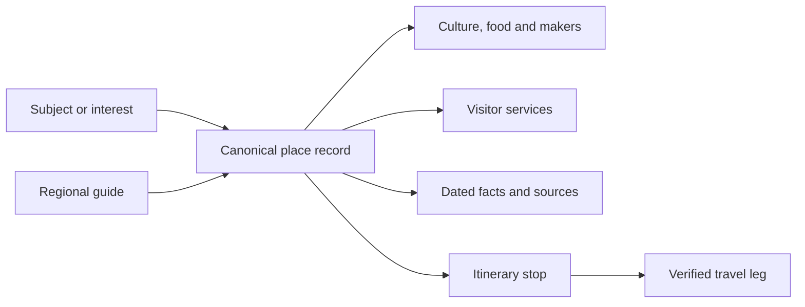

# Learning from Odisha Tourism

**Recommendation:** organise the encyclopedia around reusable place, subject, person and evidence records, then offer focused reading paths for people planning a visit. Odisha Tourism demonstrates how discovery can lead into practical planning; Utkala can connect that experience to a broader account of Odisha’s culture, livelihoods and development.

The initial **nine-page sample reviewed on 30 September 2026** was supplemented by the tour-guide directory and a visual icon review the same day: **ten distinct pages in total**, not a whole-site audit. It includes the homepage, road-trip listing and one detail, trail finder, map, handloom theme, Raghurajpur, wayside amenities and artisan stories. Browser inspection covered road cards, expanded trail filters, the map page and the loaded road-trip detail. The other pages were read through HTML extraction. No enquiry, booking, login, location permission or contact submission was performed.

## What they have organised well

The portal separates discovery, experience, planning, shopping and departmental information. A reader can enter through a destination, a cultural interest or a practical travel task.[^odisha-tourism-portal] This offers a useful model for multiple entrances to shared information.

| Observed pattern | What the sample establishes | What Utkala should learn |
|---|---|---|
| Trip cards | Road-trip cards expose duration, covered places, attractions and detail links.[^tourism-roadtrips] | Give readers enough context to decide which guide to open |
| Planning filters | Opening the trail filters revealed day-type and activity choices and a location/name search; provider/sort controls and loaded cards were visible.[^tourism-trail-finder] | Let visitors narrow by time, interest and place, using fields with known values |
| Itinerary detail | The sampled road trip includes a summary, audience/terrain tags, day tabs, first-day transport fields, food/shopping and emergency sections.[^tourism-wild-west-route] | Store itinerary stops and travel legs as explicit records, with their own evidence |
| Map and list | Search, categories and destination entries appear alongside map/list controls.[^tourism-map-finder] | Keep a usable list even when a map cannot load; validate coordinates before plotting |
| Rich destination page | Raghurajpur combines an introduction, stays, stories, essentials, related places and travel/weather sections.[^raghurajpur] | Build a consistent place-page template joining inspiration and practical details |
| Themes across geography | The handloom page connects textile discussion with several production centres.[^weaving-tourism] | A tradition can link to several places and collections without duplicated articles |
| Support infrastructure | The wayside page gives amenities a dedicated entrance, though the extracted inventory did not populate.[^tourism-wayside] | Toilets, rest stops, transport and accessibility deserve structured records |
| People and commerce | An artisan-story entrance and store-locator link exist; individual narratives were not readable in this capture.[^tourism-artisan-stories] | Create credited maker profiles, then verify any workshop or buying relationship |

Interface presence is different from functional verification. Opening the filter panel worked; complete filtering, geolocation, itinerary calculation and booking flows were not tested. The visible trail count is a website claim, not an independently audited inventory, so it has not been added to our statistical atlas.

## The organisation to adopt

Keep the existing nine subjects as the encyclopedia’s foundation. Retain the PRD’s broad entrances—subjects, places, numbers, stories and contribution—and offer **Visit Odisha**, **Made in Odisha** and **Life in Odisha** as focused collections. A reader researching education should reach education directly.

Within Visit Odisha, offer four reading paths:

1. **Choose a place:** destination areas, districts and cities, with their distinct geographic scope visible.
2. **Choose an interest:** food, craft, heritage, nature, performance and city experiences.
3. **Prepare a visit:** access, transport, stays, food providers, facilities and official assistance.
4. **Explore a journey:** reviewed itineraries once route and operating evidence is complete; until then, clearly labelled research outlines.

The diagram is a proposed content model, not a deployed interface. Geography, topic, content type, season, visit duration, audience needs and evidence status are separate dimensions. Unknown duration or accessibility must remain unknown; “family friendly” needs stated supporting features, not a decorative label.

## A place page readers can use

Start with a concise introduction and credited image, followed by “Why it matters”, “Explore”, “Food and makers”, “Plan a visit”, “Related places” and “Sources and corrections”. Keep the main story readable and reveal detailed evidence on demand.

In the planning panel, use field-level dates: access rules, opening hours, fees, transport, toilets, drinking water, step-free access and official contact. Describe verified features rather than issuing a blanket accessibility or safety score. Separate accommodation elsewhere in a region from accommodation with measured proximity to the place.

**Worked example: Raghurajpur.** Connect our [craft record](../culture/raghurajpur-pattachitra.md) to the [Puri craft-area guide](../visitor-index/areas/puri-crafts.md), [Made in Odisha](../collections/made-in-odisha.md) and evidence about the tradition. Leave named willing hosts, current workshop hours, food-serving venues and point-to-point journeys as explicit research gaps. Do not assign a duration or a “nearby” radius from the editorial grouping.

## What to improve when adapting the model

The Raghurajpur page’s nearby introduction names Sukuapada, and its accommodation section includes several other destinations. That is a concrete reason to check context and location before importing relationships; those listings do not establish local proximity.[^raghurajpur]

The sampled road detail has differing summary/description route labels and an old event window. Its transport and emergency fields need fresh checks before reuse.[^tourism-wild-west-route] Preserve the useful structure, while independently validating the contents.

Use separate labels for official editorial material, operator offers, contributor stories and measured statistics. Views, promotional rankings and reviews do not establish visits, service quality or economic impact. Do not interpret text-extraction gaps as proof that a service is absent. Retain spelling aliases while resolving identity; similar labels are not enough to merge records.

## Tour planning in practical stages

| Stage | Recommended work | Release condition |
|---|---|---|
| Apply now to the KB | Organise existing entries by place, interest and planning need; use the new trip-research template | Preserve IDs, source dates, qualifiers and explained links |
| First usable visitor guides | Deepen one area into a complete guide, with a printable reading version and official onward links | Named review plus current access, route and facility evidence |
| Later product proposal | Filter reviewed guides by start place, available time, interests and substantiated access needs; save a shortlist and offer map/list views | Explicit scope decision, populated data and tested interaction |
| Separate future decision | Automatic route optimisation, live availability, booking or operator enquiry transmission | Reliable data/services, defined operating responsibility and revised requirements |

**Start with Puri and the craft corridor**, where linked food, heritage and facility records already exist. Then deepen Koraput and Sambalpur–Bargarh for regional breadth. These are research priorities, not currently validated travel itineraries.

## Connected planning and a consistent icon vocabulary

The user highlighted the portal’s hierarchy, planning, tour guides and icon system as useful references. The suggested resemblance to TripAdvisor is an **unverified design hypothesis**; this study does not establish the portal’s design lineage.

The practical pattern to adapt is **discover a place → explore experiences → read a journey → find people and services → check current details**. These are connected entry points, not a requirement that every reader follow a fixed sequence. Keep them within Visit Odisha while maintaining direct access to the encyclopedia’s other subjects.

The [Get a Tour Guide directory](../sources/tourism-guide-directory.md) exposes district/location/city/name search, filter and sorting controls, and a contact-details section.[^tourism-guide-directory] Individual profiles and totals did not populate in the extracted text. The directory is a discovery reference; no guide’s credentials, availability or quality has been verified. Keep a **written travel guide**, a **person working as a tour guide** and a **travel agency** as distinct record types. Link professional profiles to places served, languages, specialisms and sourced credentials; a “most liked” sort is not a quality assessment.

A supplementary browser screenshot of the road-trip summary shows thin outline pictograms grouped by traveller type and terrain, with section tabs and a map below.[^tourism-wild-west-route] This is useful visual shorthand. In the captured narrow view, the small individual pictograms do not have visible text labels; Utkala should pair them with short labels, especially for unfamiliar meanings.

| Proposed icon family | Example meanings | Presentation rule |
|---|---|---|
| Discovery | Place, food, handloom, heritage, nature | Icon plus familiar subject name |
| Planning | Duration, route, transport, stay, tour guide, facilities | Pair with a sourced value or explicit unknown state |
| Wider encyclopedia | Health, education, industry, trade, data | Share the same visual family across subjects |
| Interface actions | Search, filter, map/list, save, sources | Accessible names; visible selected/focus states; never colour alone |

Start with original or clearly licensed SVG icons on a consistent 24-pixel grid and stroke system, checked at actual display sizes. These dimensions are a proposal, not measurements of Odisha Tourism’s assets. Use the existing charcoal/teal/red palette on ivory with tested contrast; reserve local art for credited illustrations and selective accents. The source icon package and licence are unknown, and no source assets were copied. The [brand notes](../../reference/brand-direction-02.md) carry the proposed direction. No icon library or planner has been implemented by this study.

## Product traceability and maintenance

The recommendations elaborate existing DISC-001/004/005 (navigation, connections and classification) and CONT-001/002/003/006 (page structure, evidence, credit and freshness). The [current PRD](../product/prd.md) remains v0.2.0. Planner interactions and transactional services above are proposals; none is silently added to launch scope or marked implemented. Promote an adopted material feature through the existing PRD version process.

- [Trip-planning content template](../methods/trip-planning-content.md) — Turn a journey idea into a record with explicit evidence gaps.
- [Visitor collection](../visitor-index/index.md) — Browse the reorganised local entry points.
- [Saved observations and mapping](../references/data/tourism-reference-study.json) — Review source scopes and the adaptation decisions.

[^odisha-tourism-portal]: [Odisha Tourism — official visitor portal](https://odishatourism.gov.in/content/tourism/en.html).

[^tourism-roadtrips]: [Odisha By Road](https://odishatourism.gov.in/content/tourism/en/plan/trip-organizer/find-a-roadtrip.html).

[^tourism-trail-finder]: [Find a Trail](https://odishatourism.gov.in/content/tourism/en/plan/trip-organizer/find-trail.html).

[^tourism-map-finder]: [Find on Map](https://odishatourism.gov.in/content/tourism/en/plan/trip-organizer/find-on-map.html).

[^tourism-wayside]: [Way Side Amenities](https://odishatourism.gov.in/content/tourism/en/plan/food-accommodation/way-side-ammenities.html).

[^tourism-artisan-stories]: [Artisan Stories](https://odishatourism.gov.in/content/tourism/en/shopping/brickMortarStores/shopArtisanStories.html).

[^tourism-wild-west-route]: [The Quest for Odishas Wild West — road-trip detail](https://odishatourism.gov.in/content/tourism/en/road-trip-detail/the-quest-for-odishas-wild-west.html).

[^raghurajpur]: [Raghurajpur](https://odishatourism.gov.in/content/tourism/en/discover/attractions/arts-crafts/raghurajpur.html).

[^weaving-tourism]: [Handloom](https://odishatourism.gov.in/content/tourism/en/experience/themes/handloom.html).

[^tourism-guide-directory]: [Get a Tour Guide](https://odishatourism.gov.in/content/tourism/en/plan/trip-organizer/tour-guide.html).
