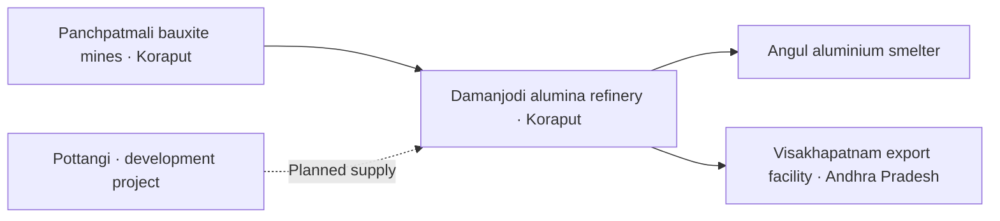

# From Koraput’s bauxite to Angul’s aluminium

**Odisha’s mineral story includes the factories that turn ore into metal.** NALCO’s reported chain joins Panchpatmali in Koraput to the Damanjodi refinery and Angul smelter, with surplus alumina moving to Visakhapatnam for export. [Operating description](https://nalcoindia.com/business/operation/alumina-refinery/).

The diagram shows reported supply relationships, not mineral conversion ratios, equal quantities or an independently checked logistics map.

## A measurable processing story

NALCO reports **471,701 tonnes of aluminium in 2025–26**, up **2.5%** on 460,137 tonnes in 2024–25. Alumina hydrate output rose from 2,075,500 to 2,300,000 tonnes, **10.8%**. These are company figures; successive material stages must not be added into one production total. Five annual observations from 2021–22 to 2025–26 span four elapsed years.

Markets moved differently. Aluminium domestic sales increased from 323,809 to 461,081 tonnes across those endpoints, while aluminium export sales fell from 133,085 to 13,238 tonnes. Total company export-sales value also fell from ₹5,516.97 crore in 2024–25 to ₹4,701.54 crore in 2025–26. Quantities and rupee values answer different questions. [Annual report, p.296](https://nalcoindia.com/wp-content/uploads/2026/08/45th-Annual-Report-2025-26.pdf).

## What can we say about work?

The company reports 1,715 permanent employees, 3,149 permanent workers and 16,722 other-than-permanent workers at 31 March 2026. The first two categories reconcile to its 4,864 on-roll workforce. These totals include its wider operations and cannot be presented as Odisha-resident jobs created.

A more local connection is the **83% share of wage costs** reported for its semi-urban category in 2025–26, compared with 81% the year before. Its footnote identifies Nalco Nagar Anugola and Damanjodi. This is a wage-cost share, not an employee share or household-income change. [Annual report, pp.14,59,93](https://nalcoindia.com/wp-content/uploads/2026/08/45th-Annual-Report-2025-26.pdf).

## Existing mines and expansion have different timelines

The report identifies Panchpatmali’s Central/North and South blocks separately, with company-reported lease validity to 16 November 2032 and 19 July 2029. Original current permits still need checking.

For **Pottangi**, NALCO reports an MDO appointment on 9 December 2025 and expects production in Q4 FY2026–27, or January–March 2027. Dilip Buildcon names itself as MDO and DBL Pottangi Bauxite Mines Private Limited as the agreement SPV. Its undated project page retains a mid-2026 target. Neither target proves production has started. [Annual report, pp.12–14](https://nalcoindia.com/wp-content/uploads/2026/08/45th-Annual-Report-2025-26.pdf); [developer record](https://dilipbuildcon.com/project/pottangi-bauxite-mine/).

## Community outcomes remain a separate question

Pottangi’s reported conveyor and water-facility components list 415 and 48 affected families separately, with the rehabilitation package awaiting finalisation in that report. Do not add the counts without checking overlap. The report also describes honey and ginger-processing livelihood projects; beneficiary descriptions establish reported programme reach, not increased income.

Safety remains part of the story: the company reports zero worker fatalities in 2025–26 after two at its smelter in 2024–25, and one recordable worker incident each at the smelter and captive power plant in 2025–26. These are own-operation disclosures; the report’s external value-chain partner totals use a different boundary. [Annual report, pp.74,93,97,102](https://nalcoindia.com/wp-content/uploads/2026/08/45th-Annual-Report-2025-26.pdf).

[Detailed evidence and open fields](../references/data/mining-programme.json) · [Mining overview](mining.md) · [Industrial production](../statistics/industrial-production.md) · [Koraput](../statistics/districts/koraput.md) · [Angul](../statistics/districts/angul.md) · [Honey and forest livelihoods](forest-products.md).

[Mining overview](mining.md) — Connects named mineral-processing relationships to separate public revenue, work and community questions.

## Local suppliers: a new reading of the saved report

NALCO reports **₹652.19 crore** of goods/services purchases from Odisha-based MSEs in 2025–26, within₹1,447.94 crore of all-location MSE procurement. This is about45.04% of that MSE total, not a share of all company purchasing. Purchases do not measure supplier profit or employment. [Saved annual report, printed p.56 / PDF p.76, section 19(a)](https://nalcoindia.com/wp-content/uploads/2026/08/45th-Annual-Report-2025-26.pdf).

This extends the inspected scope of the same original report; it is not independent corroboration. [A readable supplier story](../stories/minerals-and-local-suppliers.md).

## Apprenticeship is another route into industrial skills

NALCO reports **925 apprentice trainees engaged during 2025–26**, up to 31 March 2026. This is a company-wide annual engagement figure, not the number appointed to permanent jobs, a placement result, or an Odisha-only count. The report does not allocate it between Damanjodi, Angul and other locations. [Same saved annual report, printed p.49 / PDF p.69, section9.2](https://nalcoindia.com/wp-content/uploads/2026/08/45th-Annual-Report-2025-26.pdf).

This reading extends the existing source; it does not add independent corroboration. The report’s 9,284 employee-training figure also must not replace the 4,864 on-roll workforce: annual training participation and payroll headcount measure different things. Current unit-level payroll and contractor counts remain open.

## Work volume gives a plant view, not a headcount

NALCO’s FY2024–25 injury-statistics table reports these working-day volumes:

| Unit | Employee man-days | Contractor labour man-days |
|---|---:|---:|
| Alumina refinery, Damanjodi | 376,561 | 1,854,408 |
| Aluminium smelter, Angul | 489,800 | 1,308,875 |

Employee rows include executives and non-executives. Do not divide by an assumed working year to invent a count of people. [Report, printed p.79](../sources/mining-nalco-sd2025.md).

The existing **16,722** company-wide non-permanent-worker observation is reused. The annual report’s BRSR calls its table year-end details, while printed p.49 describes the same number as contractor workers engaged during March 2026. Neither passage supplies a plant split or unique-person method. Current unit payroll and local-resident shares remain missing.
