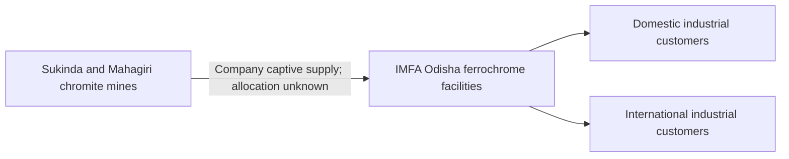

# Indian Metals and Ferro Alloys (IMFA)

IMFA dates its establishment to **1961** and places its beginnings at Therubali, described using historical Koraput geography. Its history credits [Bansidhar Panda](../people/bansidhar-panda.md) alongside Ila Panda; it lists [Subhrakant Panda](../people/subhrakant-panda.md) as managing director. Establishment, plant commissioning, production and installed capacity remain distinct measures.

[Entrepreneur collection](../people/entrepreneurs-and-business-leaders.md).

## From captive ore to ferrochrome · FY2025–26

IMFA identifies captive chromite mines at Sukinda and Mahagiri supplying its smelting operations. Its annual report describes three manufacturing facilities in Odisha, including the acquired Kalinganagar unit alongside Therubali and Choudwar. The company states that its extracted chrome ore is used captively. This establishes a company supply chain, not a mine-to-furnace shipment allocation. [Report pp.4,14–15,40,51](https://www.imfa.in/api/pdf/IMFAAnnualReportFY2526.pdf/IMFA_Annual_Report_FY_2526_10bbee90f9.pdf).

| Measure | FY2024–25 | FY2025–26 |
|---|---:|---:|
| Ferrochrome produced, tonnes | 260,190 | 267,301 |
| Domestic sales, tonnes | 34,066 | 48,769 |
| International sales, tonnes | 225,801 | 221,355 |
| Sukinda ore, tonnes | 285,851 | 273,802 |
| Mahagiri ore, tonnes | 416,012 | 536,810 |

Production rose 2.73%; domestic sales rose 43.16%, while international sales fell 1.97%. Sukinda ore fell 4.22% and Mahagiri rose 29.04%. Ore, alloy and sales are different stages and cannot be summed. The acquired plant changes the company perimeter, so output growth is not a like-for-like measure. [Table, p.40 / PDF22](https://www.imfa.in/api/pdf/IMFAAnnualReportFY2526.pdf/IMFA_Annual_Report_FY_2526_10bbee90f9.pdf).

### Acquisition and expansion have different dates

The MD reports completion of the acquired 100,000-tpa Kalinganagar unit transaction in February 2026 and production starting within two weeks. The separate greenfield unit and further furnace construction were still forward-looking in this report. The current-capacity and post-expansion figures belong to different stages; a July publication cannot establish October commissioning. No new investment total is added to the existing tracker. [pp.4,14–15](https://www.imfa.in/api/pdf/IMFAAnnualReportFY2526.pdf/IMFA_Annual_Report_FY_2526_10bbee90f9.pdf).

### People and suppliers: retain the boundary

At 31 March 2026 the standalone BRSR lists 860 permanent employees, 1,327 permanent workers and 5,206 other-than-permanent workers. These are national entity categories, not plant-level Odisha jobs or jobs created during the year. Direct sourcing from MSMEs/small producers represented 15.32% of total input value, up from 7.40%; suppliers within India represented 72.29%, up from 67.29%. The overlapping categories do not disclose an Odisha supplier share. [pp.57–59,97](https://www.imfa.in/api/pdf/IMFAAnnualReportFY2526.pdf/IMFA_Annual_Report_FY_2526_10bbee90f9.pdf).

Plant-specific output, payroll, contractor definitions, named local suppliers and mine despatch allocations remain open. [Trade story](../stories/odisha-ferrochrome-markets.md) · [Mining context](mining.md).
