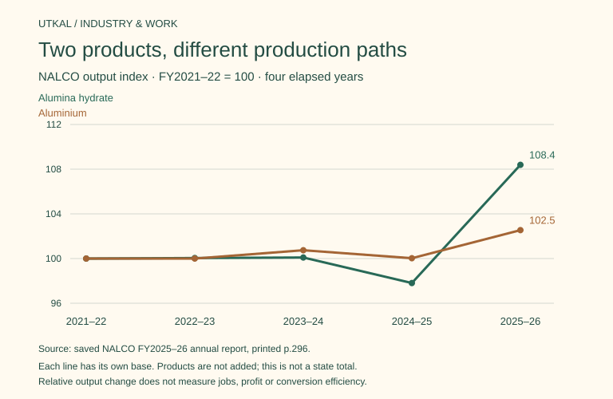

# Manufacturing output: plants, products and local business questions

**The same industrial chain can grow at different speeds.** In NALCO’s saved five-year table, alumina hydrate output increased about **8.4%** between FY2021–22 and FY2025–26; aluminium increased about **2.5%**. These are four-year changes in company output, not annual growth rates or statewide totals.

## Start with comparable physical products

| Fiscal year | NALCO alumina hydrate, tonnes | NALCO aluminium, tonnes |
|---|---:|---:|
|2021–22|2,122,000|460,000|
|2022–23|2,123,000|460,000|
|2023–24|2,124,000|463,428|
|2024–25|2,075,500|460,137|
|2025–26|2,300,000|471,701|

These ten observations reuse the existing annual-report records. The flat aluminium year and the 2024–25 declines remain visible. Do not add bauxite, hydrate and aluminium: they are successive material stages, with different flows and inventories. The chart indexes each product to its own FY2021–22 value; it compares relative change, not tonnes or conversion efficiency.

Rourkela’s saved carbon-budget history reports crude steel at 4.161, 4.045 and 4.046 million tonnes for FY2023–24, 2024–25 and 2025–26. Its rounded FY2024–25 annual-report narrative gives 4.04 million tonnes. Keep both vintages; exact production-return reconciliation is open. A clearance capacity is not annual production.

IMFA reports ferrochrome output of 260,190 and 267,301 tonnes for FY2024–25 and FY2025–26. The existing 2.73% comparison describes company output across a plant acquisition; it is not growth from an unchanged factory group. These selected companies do not form a statewide manufacturing census.

## Operating evidence needs its own measures

The SAIL FY2024–25 Rourkela paragraph reports 4.34 million tonnes of hot metal and 4.08 million tonnes of saleable steel, alongside the crude-steel figure. It also reports energy use 5.92 Gcal per tonne of crude steel, coke rate 391 kg per tonne of hot metal and furnace productivity 2.31 tonnes per cubic metre per day. The original report’s printed p.28 / PDF p.30 was visually checked. [SAIL annual report](https://www.sail.co.in/sites/default/files/2025-08/Sail%20Annual%20Report_2025_%2825_08_2025%29.pdf). Such ratios have different denominators; none alone measures absolute emissions or local environmental compliance.

CAG’s 2025 blast-furnace audit supplies a distinct historical operating lens. Its indexed p.39 shows Rourkela’s new-furnace blast pressure below the displayed 4 kg/cm² desired level in all seven years 2017–18 to 2023–24. Blast volume reached 344 thousand normal cubic metres/hour against a 330 benchmark in 2023–24. The source labels the data management-furnished. The audit also records that this new furnace met the desired oxygen-enrichment level during 2017–2024. [CAG report catalogue](https://cag.gov.in/en/audit-report/details/123664). Original table images and full replies remain to be recovered; no lost-output, causal failure or profit estimate is inferred.

## What a local entrepreneur can investigate

| Place and existing connection | A service hypothesis | Evidence required before a project plan |
|---|---|---|
| Damanjodi, Koraput: alumina processing | Maintenance, instrumentation or material-handling services | Plant procurement category, vendor qualification, current tender, actual operating need and payment terms |
| Angul: aluminium smelting | Fabrication, equipment support or product traceability | Product specification, a buyer’s confirmed requirement, approved supplier access, cost quotations and orders |
| Rourkela, Sundargarh: iron and steel processing | Repair, refractory, inspection or efficiency-monitoring services | A plant-specific contract and technical requirements; an old audit finding does not establish a current tender |
| IMFA’s Odisha processing locations | Furnace-support or quality-documentation services | Identify the actual unit and owner, required competence, contract scope and acquisition timing |

These are research questions, not proven investment opportunities. Procurement value does not reveal supplier margins. Company headcount does not establish local residence, hiring availability or new jobs caused by output growth. Current licences, standards and site permissions must be checked for a defined business model before preparing a starter plan.

## Related evidence

- [Bauxite to aluminium](bauxite-to-aluminium.md) — Reuses the production chain and separately scoped MSE procurement evidence.
- [Rourkela steel chain](rourkela-steel-chain.md) — Keeps production, historical employment and plant finances distinct.
- [IMFA](company-imfa.md) — Explains why acquisition timing changes the company comparison boundary.
- [Manufacturing value added](manufacturing.md) — Real GSVA is economic value added, not a sum of physical products.
- [Export business questions](../trade/export-business-questions.md) — Recorded shipments do not establish a new supplier’s buyer demand.

[Structured series and unresolved fields](../references/data/manufacturing-production-series.json).

## Cement and fertiliser checkpoint · 4 October 2026

[Plant output and district business questions](cement-and-fertiliser-production.md) adds named IFFCO Paradeep and Dalmia Rajgangpur line evidence. Production, sales, power generation and company-wide figures retain distinct scopes; no local jobs or supplier orders are inferred.
