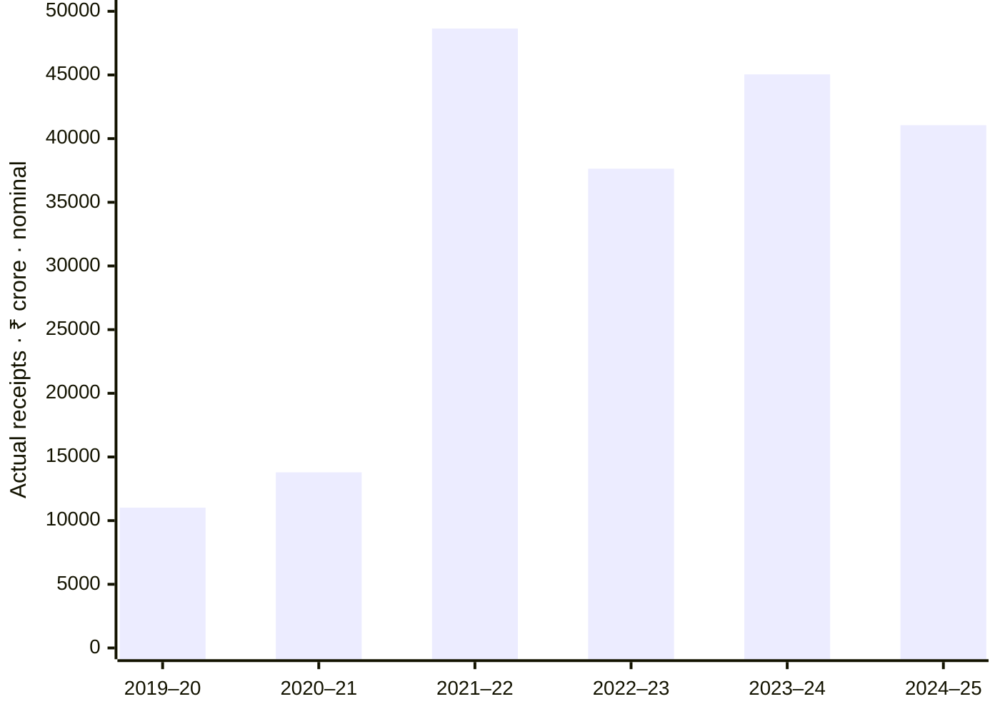

# Mining receipts: five years of growth, with volatility visible

**₹41,052 crore in FY2024–25: 3.73 times the FY2019–20 amount.** This is Odisha's actual receipt total under the accounting head “Non-Ferrous Mining and Metallurgical Industries”, in nominal rupees. The increase from ₹11,020 crore is about 273% over five elapsed years. It is not a royalty-only total, export value or inflation-adjusted growth. [Earlier series, Table2.5](https://cag.gov.in/webroot/uploads/download_audit_report/2024/7.1-Chapter-2_-Odisha-SFAR-067ee25805077d3.32203862.pdf) · [Latest series, Table1.7 and Chart1.13](https://cag.gov.in/uploads/download_audit_report/2025/SFAR-2024-25-Report-No.-3-of-2026-069cbae94884dd2.54030841.pdf).

The path was uneven. Receipts peaked at ₹48,642 crore in FY2021–22 in this six-year window. The latest year fell 8.87% from ₹45,046 crore, and its actual was below both the ₹48,600 crore budget estimate and ₹46,600 crore revised estimate. The positive long-term comparison belongs alongside that recent fall.

## Follow separate kinds of money

The detailed Finance Accounts place ₹39,287.094 crore in FY2024–25 under combined major-mineral concession fees, rents and royalties. They separately show ₹1,655.2462 crore under minor-mineral concession fees and rents, ₹99.235 crore under Mines Department and ₹10.2483 crore under other receipts. These reconcile to ₹41,051.8235 crore, which rounds to the headline. Source dashes stay missing, not manufactured zeroes. A separate minor-mineral row does not establish new economic activity or a like-for-like growth rate. [Statement14, printed p.109](https://cag.gov.in/uploads/state_accounts_report/account-report-Finance-Accounts-Volume-II-06937f8dc9af9d3-86399595.pdf).

Coal and lignite is a different head: ₹1,015.2595 crore in FY2024–25, compared with ₹1,350.5166 crore a year earlier. All-state dividends and profits of ₹4,523 crore include companies beyond mining. Neither belongs inside the 0853 series. A separate royalty-versus-auction-premium breakdown remains to be reconciled; calling the whole series “royalty” would lose that distinction.

## From mineral wealth to everyday benefits

This receipt history gives the state-finance context for [mining-area funds and functioning services](dmf-from-funds-to-services.md). The existing district evidence follows collections, sanctions, releases, expenditure, completion and actual use. It does not trace these exact annual state receipts to individual DMF projects. Cumulative DMF contributions must not be added to an annual revenue number.

Connects state receipt history to mining-area service evidence; the reading relationship does not establish earmarking or causation. [Mining overview](mining.md) · [Minerals statistics](../statistics/minerals-and-mining.md).

## Evidence details

| Financial year | Actual 0853 receipts, ₹ crore, rounded |
|---|---:|
| 2019–20 | 11,020 |
| 2020–21 | 13,792 |
| 2021–22 | 48,642 |
| 2022–23 | 37,642 |
| 2023–24 | 45,046 |
| 2024–25 | 41,052 |

Six observations span five elapsed years. The audit summaries derive from Finance Accounts; agreement is reconciliation, not independent measurement. Exact lakh-to-crore conversions and budget stages are stored in the structured evidence. Publication dates remain unknown where not established; retrieved 2 October 2026.

**Held claim:** the 2024–25 audit PDF gives OMC's dividend as ₹4,233 crore on p.17 and ₹4,223 crore on pp.32–33. Neither company-specific figure is promoted until reconciled. This does not turn the separate all-state dividend total into an OMC figure.

Next: reconcile detailed royalty/auction receipt subheads, then finish the DMF audit chapters and seek dated handover and service records. Current functioning services, human review and website publication remain unverified.
