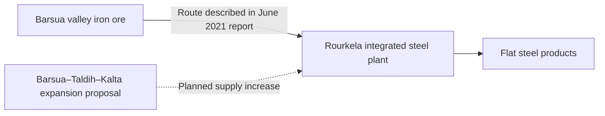

# Rourkela: ore, steel and the evidence for work

**A mine-to-metal story needs more than an expansion announcement.** Rourkela gives us a named processing plant, dated output and financial records, and a historical ore route from Sundargarh.

## The route we can document

SAIL’s June 2021 pre-feasibility report describes the Barsua valley railway connection through Bondamunda as established to carry iron ore to Rourkela. It also proposes larger Barsua–Taldih–Kalta mining and processing facilities to supply Rourkela and other SAIL plants. The existing transport description and future expansion are different claims. [Report, printed p.28 and pp.1–3](https://environmentclearance.nic.in/writereaddata/Online/TOR/28_Jun_2021_17124567022642313PFRjune2021.pdf).

The arrows do not establish present shipment quantities or exclusive supply. Exact mine-to-plant despatch records remain missing.

## Production: keep the flat year visible

The May 2026 compliance report’s carbon-budget table gives these historical crude-steel values:

| Financial year | Reported historical output, million tonnes |
|---|---:|
|2023–24|4.161|
|2024–25|4.045|
|2025–26|4.046|

That is a **2.8% decline**, followed by a **near-flat year** (about 0.02% higher). The table mixes historical values with future targets; only completed-year columns are used here. Its 4.850 MTPA clearance figure is capacity. Exact annual tonnage still needs reconciliation with production returns. [Compliance report, PDF p.27](https://sail.co.in/sites/default/files/steel-plants/2026-06/5_%20RSPs%20implementation%20status%20of%20conditions%20of%20EC%20received%20for%20HM%204.855%20MTPA%20Proejct%20other%20new%20projects%20Oct.%2C2025%20-%20March%2C%202026.pdf).

## Financial recovery is a separate story

SAIL reports **₹888.25 crore profit before tax for the Rourkela unit in 2025–26**, versus ₹20.24 crore in 2024–25. Present both figures rather than a dramatic percentage from the small base. Profit, output and benefits to local households are different measures. [Annual report, printed p.66](https://www.sail.co.in/sites/default/files/2026-09/Annual%20Report%20-%202025-26.pdf).

## What the work evidence does—and does not—show

The compliance report lists 9,872 permanent-employee and 10,803 contractual-worker entries for 2025–26 in a **health-check-up table** (PDF p.15). It reports 100% coverage but does not establish a payroll snapshot date, unique-person methodology or local residence. These numbers are retained as health-service context, not new jobs or a verified workforce total. SAIL’s 49,752 employees at 1 April 2026 are company-wide and likewise cannot be assigned to Rourkela.

Direct/contract employment, local-supplier purchases and shipment quantities remain the next plant-level evidence needs. Neither the 2021 proposal’s additional 1,133 positions nor its ₹2,740.88 crore estimated cost is treated as a realised outcome.

[Mining programme](mining.md) · [Existing bauxite chain](bauxite-to-aluminium.md) · [Detailed observations and boundaries](../references/data/mining-programme.json) · [Sundargarh](../statistics/districts/sundargarh.md).

[Mining research](mining.md) — Connects plant and supplier evidence to the broader mining programme without equating company results with household benefits.
