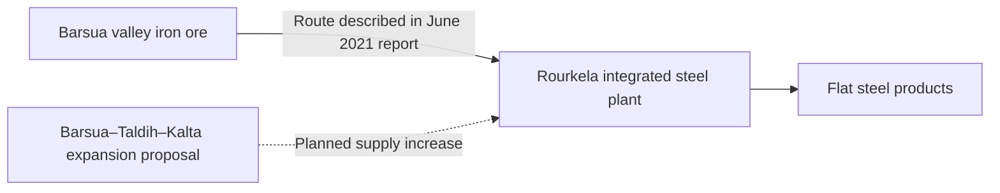

# Rourkela: ore, steel and the evidence for work

**A mine-to-metal story needs more than an expansion announcement.** Rourkela gives us a named processing plant, dated output and financial records, and a historical ore route from Sundargarh.

## The route we can document

SAIL’s June 2021 pre-feasibility report describes the Barsua valley railway connection through Bondamunda as established to carry iron ore to Rourkela. It also proposes larger Barsua–Taldih–Kalta mining and processing facilities to supply Rourkela and other SAIL plants. The existing transport description and future expansion are different claims. [Report, printed p.28 and pp.1–3](https://environmentclearance.nic.in/writereaddata/Online/TOR/28_Jun_2021_17124567022642313PFRjune2021.pdf).

The arrows do not establish present shipment quantities or exclusive supply. Exact mine-to-plant despatch records remain missing.

## Production: keep the flat year visible

The May 2026 compliance report’s carbon-budget table gives these historical crude-steel values:

| Financial year | Reported historical output, million tonnes |
|---|---:|
|2023–24|4.161|
|2024–25|4.045|
|2025–26|4.046|

That is a **2.8% decline**, followed by a **near-flat year** (about 0.02% higher). The table mixes historical values with future targets; only completed-year columns are used here. Its 4.850 MTPA clearance figure is capacity. Exact annual tonnage still needs reconciliation with production returns. [Compliance report, PDF p.27](https://sail.co.in/sites/default/files/steel-plants/2026-06/5_%20RSPs%20implementation%20status%20of%20conditions%20of%20EC%20received%20for%20HM%204.855%20MTPA%20Proejct%20other%20new%20projects%20Oct.%2C2025%20-%20March%2C%202026.pdf).

## Financial recovery is a separate story

SAIL reports **₹888.25 crore profit before tax for the Rourkela unit in 2025–26**, versus ₹20.24 crore in 2024–25. Present both figures rather than a dramatic percentage from the small base. Profit, output and benefits to local households are different measures. [Annual report, printed p.66](https://www.sail.co.in/sites/default/files/2026-09/Annual%20Report%20-%202025-26.pdf).

## What the work evidence does—and does not—show

The compliance report lists 9,872 permanent-employee and 10,803 contractual-worker entries for 2025–26 in a **health-check-up table** (PDF p.15). It reports 100% coverage but does not establish a payroll snapshot date, unique-person methodology or local residence. These numbers are retained as health-service context, not new jobs or a verified workforce total. SAIL’s 49,752 employees at 1 April 2026 are company-wide and likewise cannot be assigned to Rourkela.

Direct/contract employment, local-supplier purchases and shipment quantities remain the next plant-level evidence needs. Neither the 2021 proposal’s additional 1,133 positions nor its ₹2,740.88 crore estimated cost is treated as a realised outcome.

[Mining programme](mining.md) · [Existing bauxite chain](bauxite-to-aluminium.md) · [Detailed observations and boundaries](../references/data/mining-programme.json) · [Sundargarh](../statistics/districts/sundargarh.md).

[Mining research](mining.md) — Connects plant and supplier evidence to the broader mining programme without equating company results with household benefits.

## The people behind an expansion: a historical snapshot

**Rourkela reported 9,067 contract workers on 1 April 2015.** Of these, 5,346 were assigned to projects and 3,721 to other works and non-works activities. The same table separately lists 16,939 under manpower. These categories show why an industrial employment story needs to distinguish building projects from other plant work. [Ministry of Steel, parliamentary answer 6 May 2015, p.2](https://steel.gov.in/sites/default/files/2025-04/ru1184.pdf).

| Source category | People at 1 April 2015 |
|---|---:|
| Manpower |16,939|
| Contract workers: projects |5,346|
| Contract workers: others |3,721|
| Contract workers: total |9,067|

The two contract components sum to the contract total; they must not be added again. This is a historical snapshot, not current employment or 9,067 newly created jobs. It gives no local-resident share. The 2026 health-check table has a different purpose and cannot provide a valid employment trend from this baseline. Current plant workforce, contractor definitions and local supplier spending remain unresolved.

## Historical milestones: plant, furnace and mine · 3 October 2026

**Rourkela’s first furnace was fired before its ceremonial dedication.** SAIL dates Parvati’s first blowing-in to 24 January 1959 and its dedication by President Rajendra Prasad to 3 February 1959. Its 2018 account records the rebuilt furnace’s blowing-in on 8 May 2018. These are distinct milestones, not three versions of one date. [SAIL release](https://www.sail.co.in/en/sail-news/rebuilt-blast-furnace-1-parvati-sail-rourkela-steel-plant-blown).

SAIL’s history places Hindustan Steel’s formation on 19 January 1954, completion of Rourkela’s first 1 MT phase by December 1961, and commissioning of the Tandem Mill—the last unit of the 1.8 MT phase—in February 1968. These describe corporate formation and capacity-phase completion, not annual output. [SAIL history](https://www.sail.co.in/en/company/background-history).

The saved 2021 mine report adds ML130’s original grant on 6 January 1960 and ML162’s on 29 April 1960. These are applicant-reported grant dates; neither establishes mining start, present permission or lease fulfilment. The existing Barsua rail-route evidence above supplies the documented mine-to-plant connection. [Printed p.1](https://environmentclearance.nic.in/writereaddata/Online/TOR/28_Jun_2021_17124567022642313PFRjune2021.pdf).

[Talcher history](talcher-coal-history.md) connects two industrial histories while preserving coalfield, town, lease and plant-event distinctions.

[IMMT research](minerals-research-immt.md) connects industrial history with later laboratory and pilot stages without assigning research results to steel-plant production.

Current household benefits, worker-settlement histories and displacement outcomes require their own sources. Institutional retrospectives do not replace community testimony or archival land records. [Dated evidence](../references/data/mining-place-history.json).
