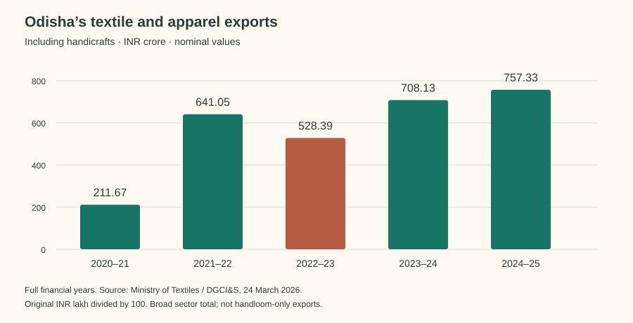

# Odisha’s textile and apparel export story

**₹757.33 crore in 2024–25**, up **6.9%** from ₹708.13 crore in 2023–24. This Ministry of Textiles series includes handicrafts alongside textiles and apparel.

Across these five annual observations, export value rose from ₹211.67 crore in 2020–21. The endpoints are four years apart; the first is the pandemic fiscal year. Growth was uneven, with a decline from ₹641.05 crore in 2021–22 to ₹528.39 crore in 2022–23. These are nominal rupees, not inflation-adjusted output.

## Evidence view

| Full financial year | INR crore |
|---|---:|
| 2020–21 | 211.6730 |
| 2021–22 | 641.0501 |
| 2022–23 | 528.3892 |
| 2023–24 | 708.1322 |
| 2024–25 | 757.3289 |

Source: Ministry of Textiles, 24 March 2026, DGCI&S table, Odisha row. Original values are INR lakh; divide by 100 for crore. This dated release is not claimed to be the latest available. It does not tell us which garment, named weave, factory or destination generated the sales. The Economic Survey’s narrower textile grouping must remain separate until definitions are reconciled.

[Source table](https://www.pib.gov.in/PressReleaseIframePage.aspx?PRID=2244418&lang=2&reg=48) · [Structured observations and calculations](../references/data/statistics-atlas.json).

## What sits inside the export number?

**Fibre and ready-made garments together account for about 99% of the December 2024 table’s FY 2023–24 textile export value.** This is a sector composition story; it does not measure handloom exports. [Original parliamentary answer, Annexure C, p.4](https://sansad.in/getFile/annex/266/AS130_m5ovdk.pdf?source=pqars).

Fibre contributes 59.35%, ready-made garments 39.62% and the remaining four segments 1.03% (rounded, calculated from the same table). Full-year RMG export value fell **4.89%** from 2022–23 to 2023–24, while the table total rose 33.99%. Both movements are retained. Prices are nominal; neither is a real growth estimate.

### Evidence view: INR crore, as reported 6 December 2024

| Source row | FY 2021–22 | FY 2022–23 | FY 2023–24 | FY 2024–25: April–September ONLY |
|---|---:|---:|---:|---:|
| RMG | 234.1357 | 294.6676 | 280.2437 | 124.1093 |
| Madeups | 0.0605 | 0.2365 | 1.2035 | 0.1338 |
| Fabrics | 2.2097 | 2.0664 | 1.0669 | 0.7834 |
| Yarn | 1.7174 | 0.7594 | 4.9786 | 1.9189 |
| Fibre | 393.8285 | 229.2306 | 419.7695 | 151.1326 |
| Other Textile | 1.2325 | 0.9114 | 0.0344 | 0.1419 |
| TOTAL | 633.1843 | 527.8720 | 707.2966 | 278.2199 |

The final column is six months, not a full-year fall. No provisional or revised label is supplied. Row sums are retained in the [segment register](../references/data/textile-export-segments.json); tiny printed rounding differences remain visible.

### Why the two official totals differ

The saved 24 March 2026 release explicitly covers textiles and apparel **including handicrafts**, while this earlier annex is labelled textile products. For 2021–22, 2022–23 and 2023–24, the later broad totals exceed the earlier segment totals by ₹7.8658 crore, ₹0.5172 crore and ₹0.8356 crore respectively. Different release vintages and definitions prevent assigning these residuals to handicrafts. Preserve both; do not splice their columns into one series or treat two copies of the same parliamentary release as corroboration.

### What an entrepreneur still needs

No destination country, physical volume, HS code or identified factory shipment appears in this table. Answer(b), PDF p.2, explicitly says district-wise revenue information is not maintained. The [eight product forms](../handlooms/garments-and-markets.md) establish documented production associations, not export success for particular products. Seek origin-linked shipment and maker-availability evidence after 11 October 2026. Existing broad annual series and its qualifications remain intact.
