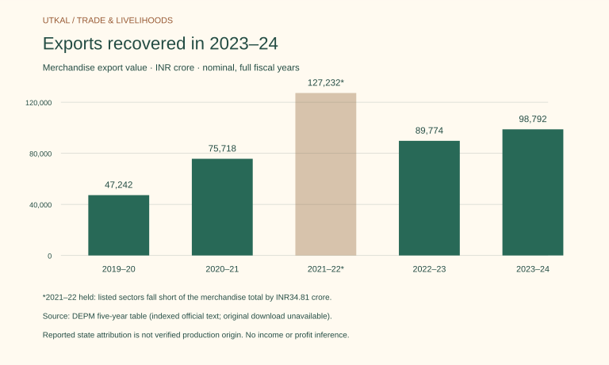

# Exports recovered, but the basket remains concentrated

**Odisha-attributed merchandise exports rose about 10% in 2023–24**, from ₹89,773.95 crore to ₹98,791.98 crore in the same DEPM table. This is nominal export value, not production volume or profit.

The recovery was uneven: the table’s mineral category rose sharply, while metallurgical, marine, agriculture/forest, handloom and handicraft values fell. A separate Parliament table identifies aluminium products, iron and steel, and iron ore as the largest three listed products. Its dollar values are not converted into rupees here.

A state export total is an administrative attribution. DGCI&S uses exporters’ origin declarations without validating those codes; port traffic and goods actually made in a district are distinct evidence questions.

## Related evidence

- [Merchandise exports](../trade/merchandise-exports.md) — The annual table retains totals, source limitations and the held 2021–22 discrepancy.
- [Destinations](../trade/export-destinations.md) — Country shares do not identify which products or districts supplied a market.
- [Business research](../trade/export-business-questions.md) — Sector scale guides questions; it does not establish buyer demand, jobs or margins.
