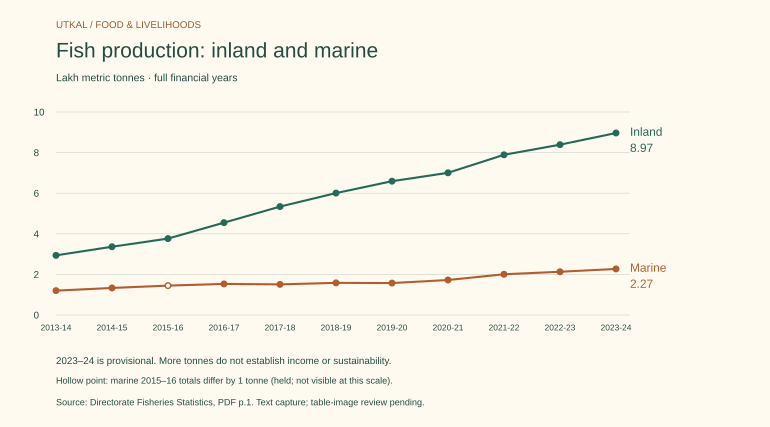

# Fish growth reaches beyond the coast

**Odisha’s inland fish output roughly tripled over the ten years to2023–24:** from293,869 to896,551 metric tonnes. The endpoint is provisional. This is a historical directorate series, read from PDF text; table-image verification remains pending.

Freshwater and brackishwater together form inland production. Brackishwater includes both culture shrimp and capture areas such as estuaries and Chilika; calling all inland production aquaculture would erase that distinction. Marine production also grew, with declines in2017–18 and2019–20 retained in the chart.

For enterprise research, this supports investigating hatcheries, feed, ice, storage and distribution. These are **questions for local market research**, not established investment opportunities: district demand, species, seasonality, mortality, permissions, water, power and producer margins still require evidence.

[Complete series and recent releases](../statistics/fisheries.md) · [Economic value added](../economy/fishing-and-aquaculture.md) · [Original table, PDF p.1](https://fisheries.odisha.gov.in/fisheries/wp-content/uploads/2025/05/01_19_33pm54f1418647aa3efbe1776df81feec0c5.pdf). More tonnes do not establish higher household income, sustainable stocks or export growth.

## Related evidence

- [Fisheries](../statistics/fisheries.md) — Production histories provide scale and category context; not income or profits.
- [Fishing and aquaculture](../economy/fishing-and-aquaculture.md) — Value added and tonnes are different metrics; growth rates cannot be substituted.
- [Chilika](../places/chilika.md) — Chilika is a named component in the brackishwater detail table, not the whole inland sector.
