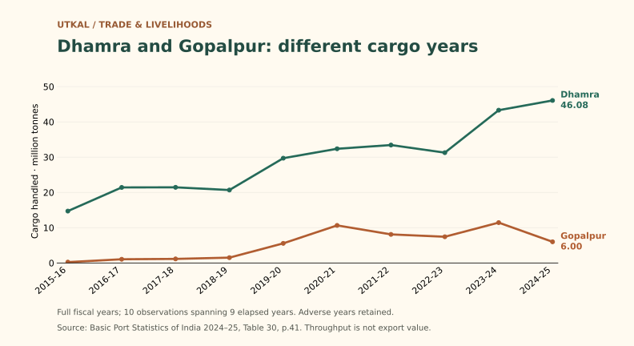

# Two Odisha ports, different cargo years

**Gopalpur handled about 47.6% less cargo in 2024–25:** 6.00 million tonnes, against 11.44 million in 2023–24. Dhamra rose from 43.32 to 46.08 million tonnes. These movements measure port activity, not exporter revenue or local business demand.

The record includes setbacks. Ten observations from 2015–16 through 2024–25 span nine elapsed years. No cause is established.

[Evidence and limitations](../statistics/ports.md) · [Structured series](../references/data/trade-logistics-series.json) · [Ministry report, Table30 p.41](https://shipmin.gov.in/sites/default/files/BPS%202024-25_compressed.pdf).

For entrepreneurs, [export value](../trade/merchandise-exports.md) is a separate research question. Cargo totals cannot establish an addressable market or expected profit.

## Read this in context

- [Port evidence](../statistics/ports.md) — Source-linked tonnage and vessel-hour evidence; no cause or current service guarantee.
- [Merchandise exports](../trade/merchandise-exports.md) — Export value and handled cargo are distinct; neither supplies business profit or Odisha-origin attribution for the other.
