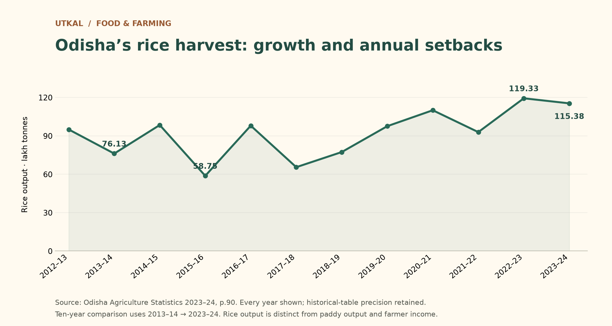

# More rice from each hectare: Odisha’s changing harvest

**Rice yield was about 55% higher in 2023–24 than ten years earlier.** The same official historical table shows output up 51.6%, while rice crop area was 2.2% smaller. This is a description of recorded changes; it does not isolate their causes.

The five-year comparison also shows higher output (+49.2%). But 2023–24 production fell 3.3% from 2022–23, and the chart retains the earlier setbacks. Starting-year conditions affect any endpoint comparison. [Source: Odisha Agriculture Statistics 2023–24, printed p.90](https://agri.odisha.gov.in/sites/default/files/2025-05/OAS%20A4.pdf).

[Rice economics](../economy/rice-economy.md) connects the trend to procurement and the evidence needed to assess farmer returns. This is an editorial draft; source checking is not public-release approval.

[Related economics](../economy/rice-economy.md) — Connects statewide crop trends with economic definitions; higher yield alone does not establish higher farmer profit.
