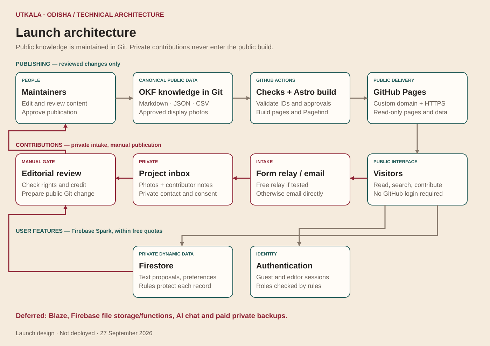
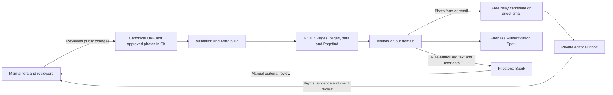
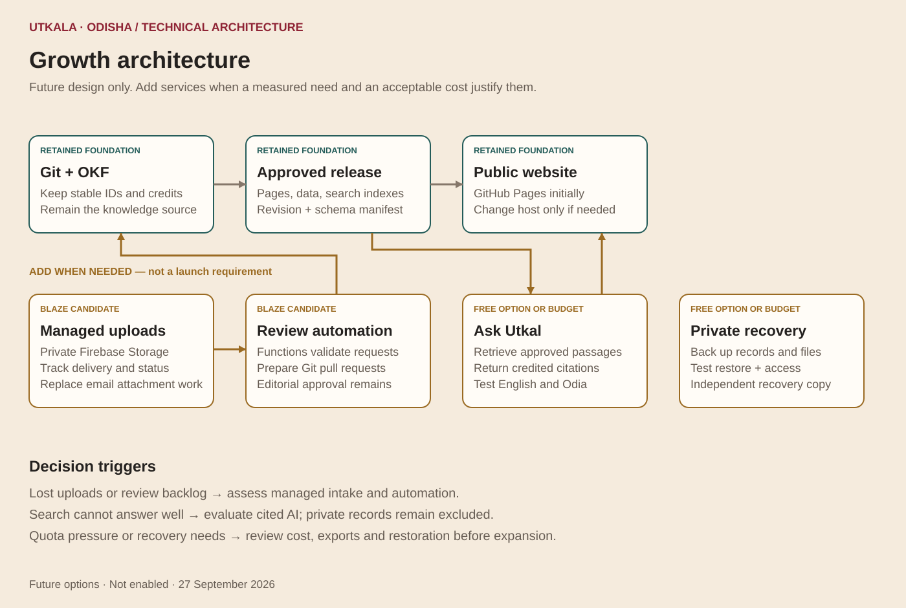
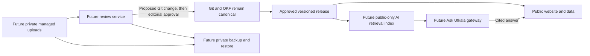

# Technical architecture diagrams

## How to read these diagrams

The launch diagram records the agreed design, not an already running system. The growth diagram records optional future capabilities. Solid paths represent intended flows, not integrations that have been tested. Private submissions pass through editorial review before any public Git change.

## Launch architecture

[Editable SVG](../references/diagrams/launch-architecture.svg) · [Mermaid source](../references/diagrams/launch-architecture.mmd)

Authentication supplies identity to Firestore rules; an arrow to Firestore does not imply public database access. Privileged roles are assigned by maintainers. The inbox contains photo attachments; Firestore does not automatically mirror it. Public pages and search do not depend on live Firestore reads.

GA4 is omitted from the drawing for clarity. It receives only approved public events after consent; it is not a content store or a copy of the private queue. Public DNS points to GitHub Pages. Assets and API requests remain separate.

## Future architecture

[Editable SVG](../references/diagrams/growth-architecture.svg) · [Mermaid source](../references/diagrams/growth-architecture.mmd)

Future services must not become an independent master encyclopedia. Private uploads, consent and account data remain excluded from public exports and AI retrieval. A paid plan, a free model tier or a proposed diagram does not by itself establish service availability, accuracy or recovery.

## Three operational sequences

1. **Read:** load a static page and its versioned data/search assets. User-specific features request only authorised private records.
2. **Contribute:** a photo arrives through the activated relay or email; a text proposal arrives in Firestore. An editor reviews it, then creates a public Git change. Only its approved content and credited media are published.
3. **Correct:** update the source concept, invalidate the affected approval, review the new content and publish a complete release. Retain redirects for renamed IDs and point saved entries to stable concepts.

## Failure behaviour

| Failure | Expected behaviour |
| --- | --- |
| Firebase unavailable or quota exhausted | Public reading/search continues; submission or account feature clearly reports failure |
| Relay rejects an upload | No false success; preserve entered text where feasible and offer direct email |
| Email accepted by relay but not delivered | No claim of inbox delivery; test mailbox routing and follow the manual receipt process |
| Build validation fails | Previous published release stays available |
| Private records are lost | No promised recovery while private backups are deferred |
| Future AI lacks evidence | Say the collection cannot answer; do not invent a source |

These diagrams are authored for Utkala · Odisha with AI assistance. They depict application architecture, not historical evidence or a formal OKF conformance certification.

[Stack and responsibilities](technical-stack.md) · [Growth triggers](growth-roadmap.md)
