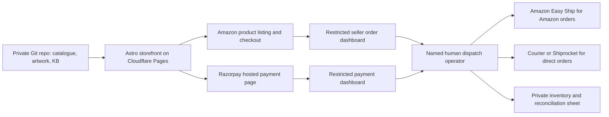

# Low-budget commerce and marketplace launch v0.1

28 September 2026 · Recommendation for Founder review. Research and planning only; no account creation, payments, supplier contact, listings or deployment performed.

Founder request: “We need to see how we enable e-commerce with very low budget and start selling these in amazon and other places too”. India-first is the planning assumption because fulfilment is intended through Bangalore vendors. Initial cash budget, legal seller/GST status, pickup address and dispatch operator are unanswered inputs. Do not infer a legal entity from the Utkal Collective project name.

## Recommendation

Retain the Astro storefront and Git-managed catalogue. Use a free static host for the commercial site, an external hosted payment page for first direct sales, and Amazon India as the first marketplace. Keep monthly software subscriptions at zero within free-tier limits. Start with one approved hero product and the jhula bag; the remaining collection stays visible as coming soon until sampled. Add Flipkart after dispatch and returns are dependable. Do not attempt every marketplace at launch.

For the absolute minimum operational setup, the first website buying button can link to a real, approved Amazon listing. Amazon then handles checkout and its order records; the site remains the brand/story hub. Direct prepaid sales can open alongside or shortly afterwards once payment onboarding and shipping are ready. Paid stock and quality matter more than custom checkout code at this stage.

## Architecture and persistent data

Git contains public product facts, SKUs, approved prices, photos and channel links. It is not the live inventory or order system. Buyer names, addresses, phone numbers, payment/order exports and credentials never enter the repository. Customer information stays in the provider dashboard and restricted fulfilment records. For a tiny operation, a private spreadsheet records stock, reservations, dispatch and settlements; access goes only to the Founder and an explicitly authorised operator. Restrict retained PII to fulfilment needs.

**Hosting correction:** [GitHub Pages limits](https://docs.github.com/en/enterprise-cloud@latest/pages/getting-started-with-github-pages/github-pages-limits) prohibit using Pages to run an e-commerce business. Keeping source code in GitHub is different from hosting the store on Pages. Use [Cloudflare Pages Free](https://developers.cloudflare.com/pages/platform/limits/) for the small static app, subject to its limits and terms. Its documented free limits include 500 builds/month and 25 MiB per individual asset. Domain purchase/renewal is separate and recurring. A subdomain of an existing domain can avoid another registration.

No Firebase, paid database, always-on server or multi-channel synchronisation subscription is necessary for this pilot. Revisit automation when manual reconciliation causes errors or becomes a significant daily task.

## Direct sales without a custom checkout

[Razorpay Payment Pages](https://razorpay.com/docs/payments/payment-pages/create/) support dashboard-created pages without an API integration, fixed prices, quantity limits, limited stock settings and custom fields. Use a fixed provider-side price for each SKU/variant, collect delivery address/pincode and contact details in required hosted fields, and explicitly state supported delivery geography and shipping charges. Avoid a customer-entered price. The existing browser-saved selection is not a verified checkout; its amounts or success URL cannot authorise fulfilment.

Start with a single product or fixed bundle checkout. A dynamic multi-item cart with calculated postage and real-time shared stock requires further work; do not pretend that a generic payment link provides it. Test supported pincodes, required fields, variants, payment success/failure, refund and stock exhaustion before activation. The operator confirms captured payment in the provider dashboard, creates the order record and invoice, packs and books a shipment, then shares tracking. A provider receipt is not automatically the seller's tax invoice.

[Razorpay pricing](https://razorpay.com/pricing/) currently lists no setup or annual maintenance fee and a standard 2% platform fee plus GST, with some methods priced differently. Use the actual onboarding rate card. Prepaid-only direct sales are recommended initially to limit COD reconciliation and return-to-origin exposure; marketplace delivery/payment options follow marketplace rules.

[Shiprocket](https://www.shiprocket.in/pricing/) advertises a free Lite plan. Shipping is still charged. Obtain pincode-to-pincode quotes using actual packed weight and dimensions; advertised averages are not a quote for a fragile cup or an insulated bottle. A local courier can be used instead where economics or pickup reliability are better.

## Amazon India first

Use one approved seller account and a registered pickup/return location. [Amazon's registration guide](https://sell.amazon.in/sell-online/seller-registration-guide) covers GST verification, bank details and pickup; it says the pickup address should be in the GST registration's state. For these taxable merchandise categories, plan for the GST documentation Amazon requests and have an Indian accountant confirm the exact entity/state/invoicing setup. Do not assume every small-seller GST exception is accepted by every channel or permits interstate sales.

Proposed first fulfilment method: Easy Ship if the pickup location is serviceable. We or the authorised vendor store and pack the items; Amazon collects/delivers. Self Ship is an alternative after comparing courier cost and tracking requirements. FBA can wait until proven demand justifies sending stock to Amazon and any additional storage/tax/return obligations. See [Amazon fulfilment FAQ](https://sell.amazon.in/sell-online/faq).

Prepare real sample photography, truthful product titles, specifications, size/capacity/colour variants, packaging, costed prices and dispatch promises. Current AI concepts must not substitute for proof of the product buyers will receive. Use Utkal branding consistently on product and packaging. Amazon permits applications for [GTIN exemption](https://sell.amazon.in/sell-online/list-your-products) for eligible products without barcodes; approval is not automatic. Confirm brand/category eligibility before buying barcode ranges. Brand approval, trademark protection, GTIN exemption and Brand Registry are separate processes.

[Amazon's current fees](https://sell.amazon.in/fees-and-pricing/) include referral, closing, weight-handling and potentially other charges. Many eligible categories have zero referral fee at prices up to Rs 1,000, but not zero selling cost. Closing fees were revised in September 2026. Run the actual category/price/packed-weight/pincode through the current seller calculator; do not price a premium bottle below a threshold if that destroys margin. Do not import US Amazon subscription prices into an India plan.

Vendor dispatch is acceptable only after the seller's fulfilment arrangement, invoices, packaging identity, pickup, returns and marketplace requirements are settled. A vendor who merely prints items has not agreed to reliable daily dispatch. Use ready stock for Amazon initially; ordinary fixed Utkal artwork does not itself require Amazon's buyer-customisation programme.

## Other channels and sequence

| Channel | Proposed use | Timing and economics |
| --- | --- | --- |
| Own website + shared product links | Brand, story and direct prepaid orders | First launch; hosted payment charge and courier cost per order |
| Amazon India | Search demand and trusted checkout | First marketplace; account eligibility and full unit economics checked |
| Flipkart | Additional reach | Second marketplace after reliable dispatch; [fee guide](https://seller.flipkart.com/fees-and-commission) includes fixed, collection, shipping and category charges. A [November 2025 announcement](https://storiesflistgv2.blob.core.windows.net/stories/2025/11/Flipkart-Press-Release_Zero-Commission-Model-2025.pdf) introduced zero commission below Rs 1,000 for eligible sellers; confirm current account-specific rates |
| Meesho | Optional test for price-sensitive bag/tee demand | Later; official pricing page could not be retrieved. No verified fee estimate or premium-brand fit assumed |
| Instagram, WhatsApp, events and hospitality partners | Discovery, community sales and gifting | Direct buyers follow the website/payment flow; obtain partner terms before supplying stock |
| ONDC or international marketplaces | Further distribution | Later, after a specific seller-network participant/export arrangement and full costs are evaluated |

The recommendation to postpone Meesho and focus on community/heritage audiences is positioning judgment, not a claim about guaranteed platform performance. No channel guarantees sales. Avoid initial ad subscriptions; first collect paid demand through the Founder's network, Odisha community and relevant events without treating outreach as authorised by this plan.

## Stock and fulfilment discipline

Give every saleable size/colour a distinct stable SKU. Four product designs already create at least nine variants: five tee sizes, one bag, one cup and two bottle colours. Four products are not four inventory positions.

For each SKU, count physical saleable stock and allocate separate quantities to each active channel, keeping a small buffer. Example: 10 bottles physically available, allocate 4 to Amazon and 4 to direct checkout, keep 2 as buffer; never advertise all 10 independently on both. Maintain provider stock caps and pause listings when allocations are exhausted. Reconcile orders, cancellations, returns and inventory daily and before reallocating; reserve stock for confirmed orders. Returned goods are inspected before being restocked. Git rebuilds are not real-time stock control.

One named human/operator must own packing, label printing, pickup handoff, customer messages and returns. If the Founder is not in Bangalore, settle this role with a vendor or other authorised person before launch. Marketplace orders remain within their own customer-service and returns rules; do not move those buyers off-platform to evade fees.

## Cash budget: planning allowances, not quotes

Assume a Rs 10,000-20,000 pilot while awaiting the Founder's answer. A possible Rs 18,000 allocation is:

| Use | Planning allowance |
| --- | ---: |
| Samples, print proofs and courier | Rs 4,000 |
| Plain protective packaging and labels | Rs 1,500 |
| Very limited initial stock | Rs 8,000 |
| Courier wallet, returns and settlement-delay buffer | Rs 4,500 |
| Total | Rs 18,000 |

This excludes unknown business setup/accounting costs, domain renewal and paid photography/design labour. It is not enough to promise an all-variant premium launch. Below Rs 10,000, approve samples and one very small product run first; use a clearly labelled made-to-order direct offering only after supplier lead time is reliable. Avoid custom moulds, elaborate gift boxes, large MOQs and all-size tee inventory. Stock the bag first if economics work; choose the premium bottle only if compliant small-batch sourcing fits the budget. Cups need packaging/drop testing and tees need size/print/wash checks.

Working-capital need includes production and delivery expenses incurred before marketplace/provider settlement, replacements and refund exposure. A zero monthly software bill does not mean a zero-cost business.

## Pricing and acceptance

For every channel, calculate contribution from revenue excluding collected output tax, less landed product/print cost, packaging, gateway or marketplace fees, outbound fulfilment, expected return/damage cost, non-recoverable tax on costs, discounts and attributable advertising. GST input credits and marketplace tax withholding need separate accounting; do not automatically count recoverable withholding as a permanent commission. Set prices only after supplier quotes and applicable product tax classification are confirmed. Target a positive contribution with a return allowance, then assess whether it also covers human time and overhead. No retail prices are approved by this document.

The insulated bottle needs special sourcing care: [BIS compulsory-certification listings](https://www.bis.gov.in/product-certification/products-under-compulsory-certification/scheme-1/?lang=en) cover domestic stainless steel vacuum flasks/bottles under IS 17526 and the related quality-control framework. Check the actual manufacturer's applicable licence/scope and required marks for the selected blank; SS 304 wording alone is not sufficient. Confirm decorative printing permission, truthful manufacturer/packer/origin information and required retail declarations before listing. The Bangalore supplier's role and the actual manufacturing location must be described accurately.

## Work to first sale

1. Founder sets pilot ceiling and identifies legal seller, bank/payment eligibility, dispatch state/address and the human operator.
2. Prepare a quote request for small MOQ, two bottle colours, product/print samples, compliant blanks, invoices, packaging and daily dispatch capacity. Send only when authorised.
3. Approve physical samples, actual product photographs, pack/drop/wash/leak checks as applicable and SKU-level economics.
4. Prepare Amazon account/listing drafts and, if direct sales are enabled, Razorpay test pages. Record actual fees and marketplace identifiers privately where appropriate.
5. Add approved channel links to the Astro catalogue, hosted on a permitted commercial host. Publish seller/contact/privacy/shipping/return terms and an honest delivery promise.
6. Test checkout, address capture, quantity/stock limits, refund, order-to-invoice reconciliation, dispatch/tracking and channel stock allocation. Customer/payment data stays outside Git and analytics.
7. Founder approves the exact products, prices, quantity exposure, policies and deployment. Open a limited pilot; inspect the first 20 fulfilled orders for contribution, defects, returns and dispatch performance before widening distribution.

If analytics is enabled later, track product views and outbound channel clicks separately. A click to Amazon or a payment page is not a purchase; confirmed sales come from channel reports/dashboard reconciliation. Do not send names, addresses, payment IDs or other customer details to web analytics.

## Source and decision status

Sources were checked on 28 September 2026. Public rate cards are guidance; actual onboarding rates, GST treatment, pickup eligibility, stock availability and product compliance must be confirmed for this seller. Meesho's official pricing was inaccessible. All provider choices and budget allocations here are recommendations, not recorded Founder acceptance.

Related: [Store PRD](store-v0.1.md) · [Current designs and proposed samples](sample-pack-v3.md).
